# Driving Electronic Paper Displays (E-paper)
# AN0063 - Application Note

## Introduction

This application note shows how to drive an Electronic Paper Display (EPD) with an EFR32xG22 based Silicon Labs Wireless Kit. The application note makes use of an EPD extension board made by Eink is connected to the xG22 Wireless Kit (BRD4182A and BRD4001A boards). The xG22 Wireless Kit with the Eink panel is controlled wirelessly with another wireless kit. 

This application note includes:
 - This document
 - Simplicity Studio IDE projects
 - Source files (in the project)
 - Example C-code (in the project)
 
## 1 Electronic Paper Displays

Electronic Paper Displays (EPDs) are types of displays that are reflective and bistable. Reflective in this case means they rely solely on ambient light and does not use a back light. Bistable is the property of retaining an image even when no power is connected.

EPDs are commonly used in e-readers, industrial signage and electronic shelf labels. Their properties are ideal for applications which do not update the image frequently. Since the display draws no current when showing a static image, they allow a very long battery lifetime.

### 1.1 EPD Cell - Three Pigment Ink System
The pixels in an EPD are made up of millions of tiny microcapsules, each about the diameter of a human hair. E Ink’s Spectra product line utilizes a 3-pigment ink system in a microcup structure. This ink was engineered specifically for Electronic Shelf Labels (ESL) and is offered in black, white and red. This ink system works similarly to the dual pigment system, in that a charge is applied to the pigments, and to a top and bottom electrode to facilitate movement. However, instead of the use of microcapsules, this system utilizes Microcups®, which are filled with the liquid and sealed. [More info about the technology ...](https://www.eink.com/electronic-ink.html)

<p align="center">
  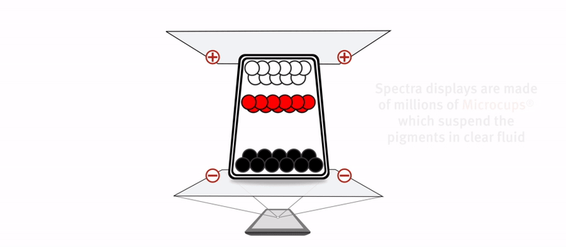
</p>

**Figure 1.1. EPD cells**

> Note: source of the picture and the description is https://www.eink.com/electronic-ink.html.
 
### 1.2 Benefits of EFR32xG22
Since EPDs have the ability to draw no current, the current consumption of the MCU and the rest of the application becomes very low on long run. The flexible Energy Modes of the EFM32 allows the MCU to always draw as little current as possible. In many EPD applications Energy Mode 4 can be used, where the MCU consumption can be as low as 170 nA.

Memory is important to save frame buffers and images. The EFR32 has large memory options, both for Flash and SRAM. At the time of writing, the largest options include 512 kB of Flash and 32 kB of SRAM.

### 1.3 Considerations

Even though the EPDs draw no current while showing a static image, they require a significant amount of current while updating the display. The display update itself also takes a long time (typically 12 seconds for black and white, 18 sec for red dots). EPDs are therefore not suited to applications that require a high update frequency.


## 2 EPD Extension Board

<p align="center">
  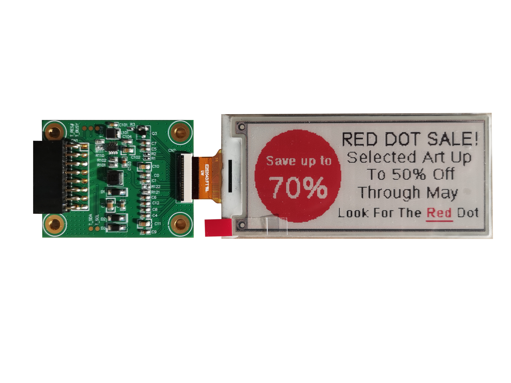
</p>

**Figure 2.1. Eink Displays Extension Board with connected 2.9" display**

This application note makes use of the EPD extension board made available by Eink to illustrate how to drive an e-paper display with an EFR32 microcontroller. The EPD extension board is available for sale with [HULK Driving Board](https://shopkits.eink.com/product/hulk-driving-board/) and the full schematics, documentation reference code be attached to this document. Furthermore, these documents can be asked for free via the Eink customer support. Documentation and ordering information are also can be found on their webpage.

The extension board includes:
 - just the necessary Eink EPD driver components
 - it is based on the reference circuit, so an excellent base for new design
 - 16-pin header to connect MCU

The flat panel connector is compatible with most of the EPD panels. Additionally, the EPD panel related flat connector is very sensitive to physical forces, like bending, twisting or stretching, so a temporary tool should be used - during the development phase - to fix the display and the driver position in order to prevent permanent damage. The signals required to drive the panel are routed out on the 16-pin header. The kit comes without standard jump wires, so for initial testing, these cables are also required or you can create a probe panel were the signal and power lines connected among the WSTK and Eink display driver, see Figure 2.2. Table 2.1 shows how to connect the Eink display driver board to the EFR32XG22 based Wireless Starter Kit.

<p align="center">
  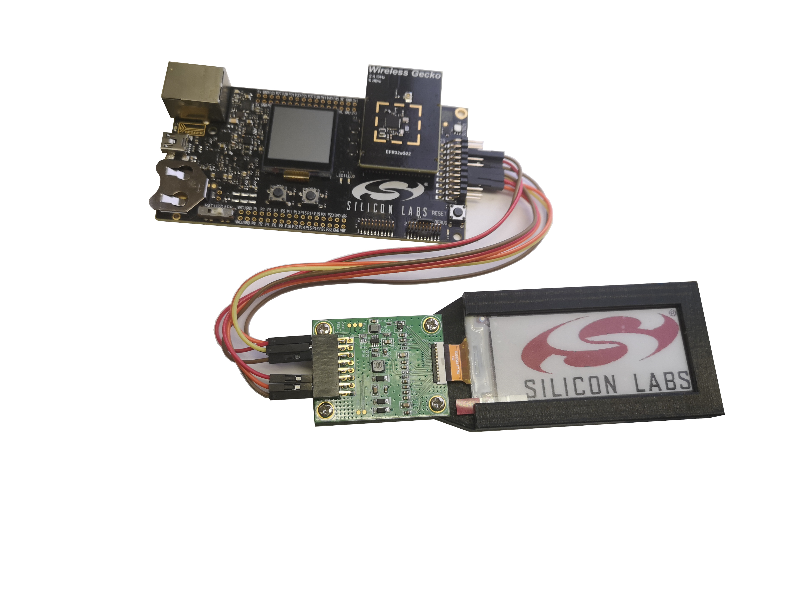
</p>

**Figure 2.2. Eink driver and WSTK connected**

<p align="center">
  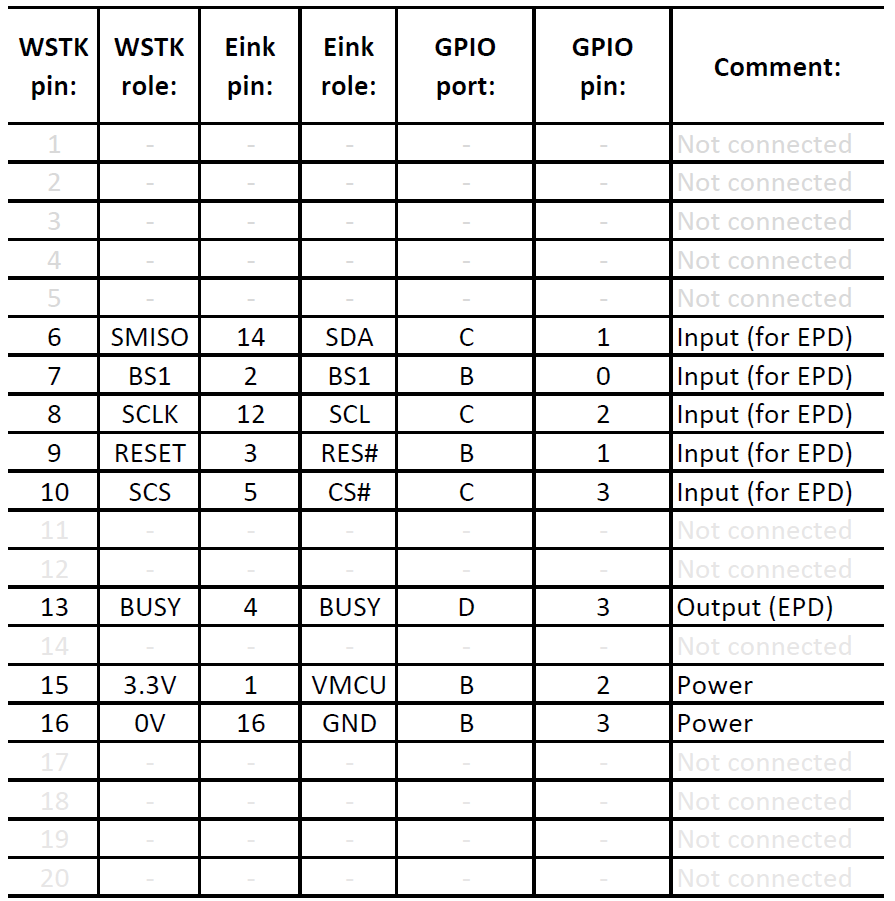
</p>

**Table 2.1. Connection Table**

> Note: The WSTK has power lines, like GND and VMCU have dedicated pins on extension header - namely WSTK pin 1 and WSTK pin 2. These pins can also power up the Eink driver board. Basing on the EPD driver does not have "power switch" to shut down itself, therefore if the previous power lines are used then there will be no way to shut down the Eink driver panel - it will constantly consume a significant amount of current. That's why GPIO pins are used to power up the EPD. 

For an easier interpretation, the following figures also describe the wires among the PCB boards. The pin numbering on the WSTK are highlighted. 

<p align="center">
  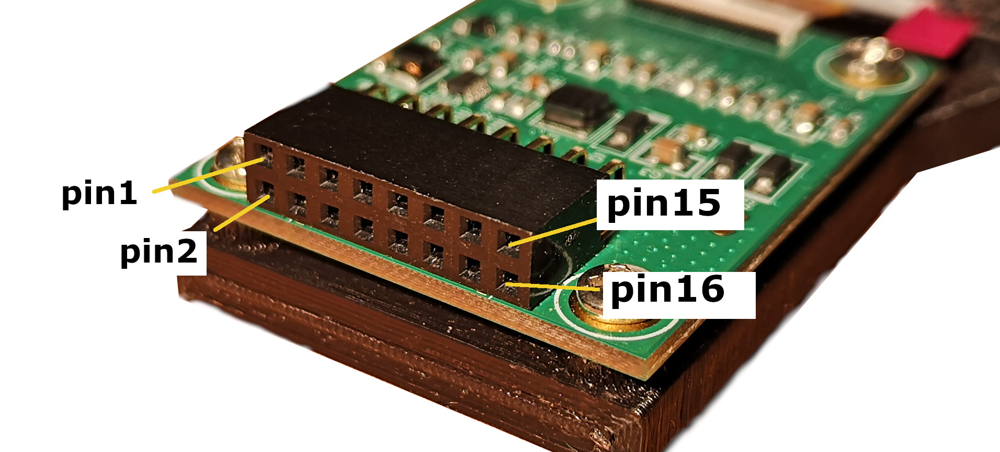
</p>

**Figure 2.3. Eink driver pin out marking**

<p align="center">
  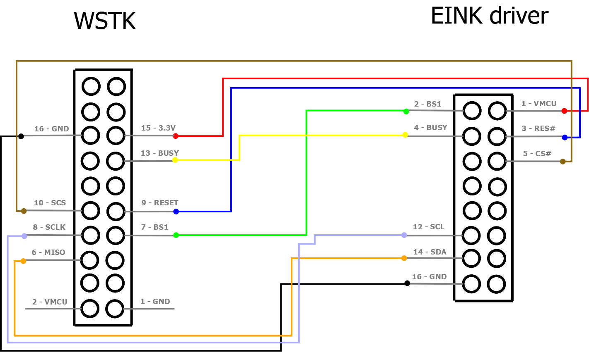
</p>

**Figure 2.4. Wirings among the WSTK and EINK driver**


## 3 Driving an EPD with EFR32

This chapter will explain what the MCU needs to do in order to update the EPD panel. All the information in this chapter is based on the documentation released by Eink. See this documentation for details about each step, including SPI commands and timing.

### 3.1 Chip-on-Glass Driver

The EPD panels from Eink come with an integrated Chip-on-Glass (COG) driver that controls the behavior of the panel. The COG has a 3-lines serial peripheral interface (SPI) - or 4-lines, depending on the configuration - that is used to accept commands from the EFR32. 

### 3.2 Charge Pump

When writing a new image to the display, the panel itself requires a large voltage across it in order to drive the pixels. To achieve this without an external voltage supply, a charge-pump circuit is used. The Eink display has an on-chip oscillator, on-chip booster, and regulator control for generating VCOM, Gate, and source driving voltage for its proper operation.

### 3.3 Image Update Sequence

To draw an image on the EPD panel, the MCU must:

1. Power up and initialize the COG.
2. Write the image data to the DTM1 and DTM2 buffers according to the desired color for each pixel.
3. Power off the COG driver.

During initialization, the MCU communicates with the COG by sending SPI commands and must adhere to specific timings laid out by the COG documentation. The MCU should keep only one frame in its buffer memory: the frame of the new image. 

The following image update process happens automatically, it is driven by the EPD display related COG:
The Eink display related COG has two buffers for the images: one for the new image to be displayed, and the old image currently visible on the panel. During image update, the panel is updated in four stages:

1. The current image is inverted
2. The entire panel is drawn white
3. The inverse of the new image is drawn
4. The new image is drawn

During each stage, the same frame is written multiple times to the display. The number of times a frame should be rewritten is dependent on both the type of display and the current temperature. A colder environment makes the particles within the pixel cells move more slowly and therefore requires the panel to be rewritten more. If the application should work in varying temperature conditions, the temperature should be measured before writing to the display - but Eink display has an inbuilt temperature sensor, so this happens also automatically in this application note. The EFR32 also has an internal temperature sensor that can be used.

After the frame has been written, the COG should be powered down. This process also has a specific sequence of commands and timings the MCU must obey. During this sequence, the pixel registers are first cleared and then the charge-pump capacitors are discharged. After the power-down sequence is finished, all power to the panel can be removed and the image will be kept on the panel.

### 3.4 Frame Buffer

The COG expects each frame in a special format. A pixel is labeled (x,y) where (00) is the lower right of the display. The update of the EPD display happens from column to column, starting from each column's bottom - so the developer should handle this display frame as a long 1-dimensional array. Each pixel is described by 1 bit, and the color of this pixel is based on pixel actual value and the previous value. This process is visualized in the first chapter - 1.1 EPD Cell - Three Pigment Ink System. 

<p align="center">
  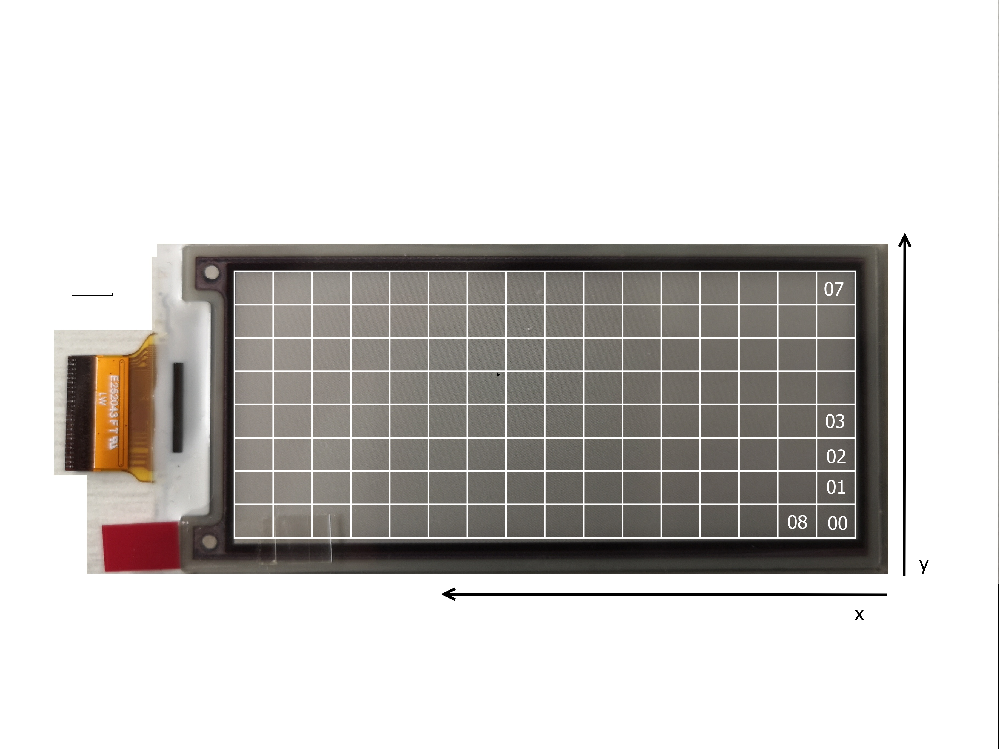
</p>

**Figure 3.1. EPD Frame**

The update mechanism is handled automatically by the EINK display-related COG. On the registers and the embedded software level, the developer gets two buffers: DTM1 - as previous value - and DTM2 is the next value. Basing on this simplicity, the color of the pixels - bits - can be defined by the following mapping table.

<p align="center">
  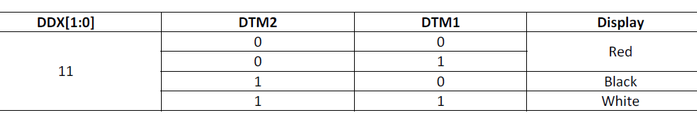
</p>

**Table 3.4. EINK Image processing tool**

### 3.5 Rendering with EINK Image processing tool

The EINK Image processing tool is a python-based tool developed by Silabs, which is made for this application note. The tool is totally open source, so the readers/users can change it according to their needs. The tool can be found under *pc_tool* folder and with a simple double click to the *start_imageConsol.bat*, the application will start and no further adjustments are required to generate the sufficient frame format for the EINK 2.9" tri-color display.   

#### 3.5.1 Converting Images

The EINK Image processing tool can open common image formats (like GIF, BMP, PNG) and save the output as a normal 1 dimension array can be included and compiled into the MCU application.

When using the EINK Image processing tool to prepare an image for use on an EPD, first open the desired image [File -> Open File]. Then, two picture frames will appear on the screen: the bigger one is the original picture, with the original screen aspect ratio. In case the original picture is bigger than ``640*480`` pixels, then the original picture will be reduced to ``640*480`` pixels among holding the original aspect ratio. The right, smaller picture is a ``294*128`` resolution picture, which shows the expected picture on the EINK display. It can be further adjusted for a better look via rotating option [Process -> Rotate right/ Rotate Left].     

The output byte stream - and bit-stream, but bit-stream just for fun - can be found under the EINK Image processing tool-related *python\tmp\* folder. The byte stream should be used in the MCU application as the content of a 1-dimensional array. The generation of these files is performed automatically after any image processing option, like open, or rotation in any direction. 

<p align="center">
  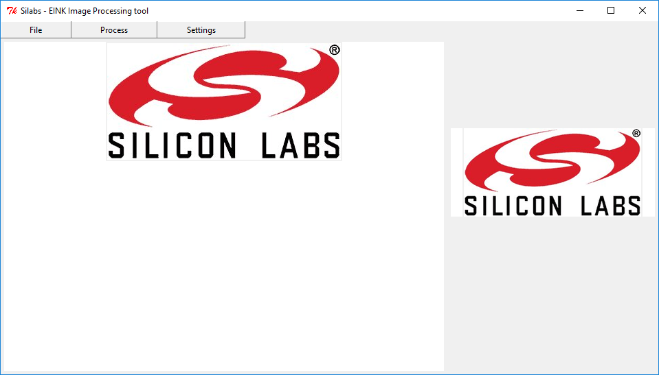
</p> 

**Figure 3.2. EINK Image processing tool**

> Note: an interesting thing: on the bit level, the image shape is still visible.

<p align="center">
  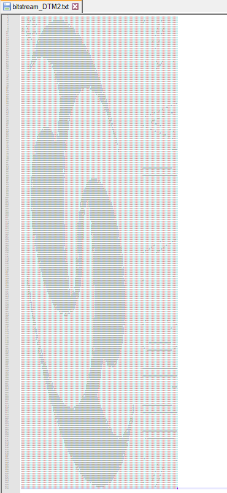
</p>

**Figure 3.3. Bit-stream**

## 4 Power Consumption

The EPD only consumes power during a display update. A display update however takes a significant amount of time, typically between 12-18 seconds at room temperature.  Beside this time, the MCU must complete the power-up and power-down sequences and transmit frames to the panel.

To optimize power consumption during a display update, the MCU should be put in its optimal Energy Mode at all times. When performing CPU intensive tasks - like in the future: rendering a new image -, the MCU should run at a high frequency. During the update stages, when the frame is transmitted over SPI to the EPD panel, the clock frequency can be slower since the stage should nevertheless run for a predetermined amount of time. During the periods, when the MCU is waiting for the COG to be ready, the MCU can be in a sleep mode.

The main parameter that can be optimized to save power during a display update is the BUSY periods. The EINK display uses the BUSY pin to signaling that no EFR32 interaction allowed. During these busy periods, the MCU can go to sleep, decreasing the overall current consumption. 

<p align="center">
  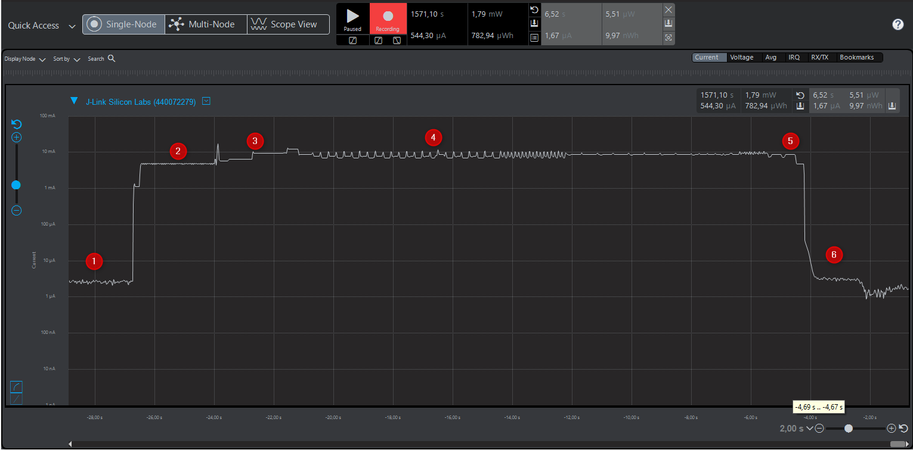
</p>

**Figure 4.1. EPD + MCU power consumption**

Figure 4.1 shows a breakdown of the power consumption of the MCU + EPD during a display update. This figure is taken with the Energy Profiler while the MCU is running the **5.2 Eink driver example with wireless update** example from this application note. 

Referring to the numbers in the figure:
1. EFR32 in EM4 power state - just sleeps and waiting to a wake-up event.
2. The EFR32 receives the new frame and stores it in the memory.
3. EFR32 powers up the Eink display driver, powers up the COG and charge-pump and transfers the new frame to the Eink.
4. Eink COG updates the display with a new frame.
5. COG shutdown sequence and EFR32 releases the power/SPI/etc lines between the EINK driver and WSTK.
6. Power is cut to the panel. MCU is in EM4. 

> Note: the measured EM4 current is much higher than the expected `n*100nA`. It is based on the architecture of the EPD driver board, the absence of a "power switch" on the EPD board causes leakage current on the GPIO pins. However, the average leakage current on most of the GPIO pins is ~2nA (in room temperature), on the other side there are special function pins where leakage current can exceed the `n*100nA`. Basing on not all the EFR32 pins are routed to the WSTK's expansion header, few of these high leakage current pins are used in this application. 


### 4.1 Choosing a Sleep Mode

Since EPDs do not require power or interaction while displaying a static image, this enables the possibility to use EM4 as a sleep mode. Whether it makes sense to use EM4 depends on the application, specifically if other tasks need to be performed during sleep, and the update frequency.

In EM4 the EFR32 can draw as little as 0.17 uA of current and wakes up on a GPIO interrupt (NB: only on selected pins, see reference manual). However, when waking up from EM4, the MCU has to go through a full reset and run the startup/initialization code gain, which will add to the average current consumption. Therefore, it is application dependent which has long slept periods and gains the most by using EM4.

The theoretical advantage of using EM4 is shown in Figure 4.2. The graph is calculated assuming a simple application that stays in a sleep mode and updates the display based on a periodic GPIO interrupt. The horizontal axis is the update period, and the vertical axis shows the average current consumption. At short update periods (high update frequency) the current consumption is dominated by the active mode current consumption of the MCU and the current the EPD draws when updating the image. In this case, the sleep mode current can be ignored. However, as the update period gets longer, the average current consumption becomes dominated by the sleep mode current consumption.

**Figure 4.2. Average current consumption (MCU + EPD)**

<p align="center">
  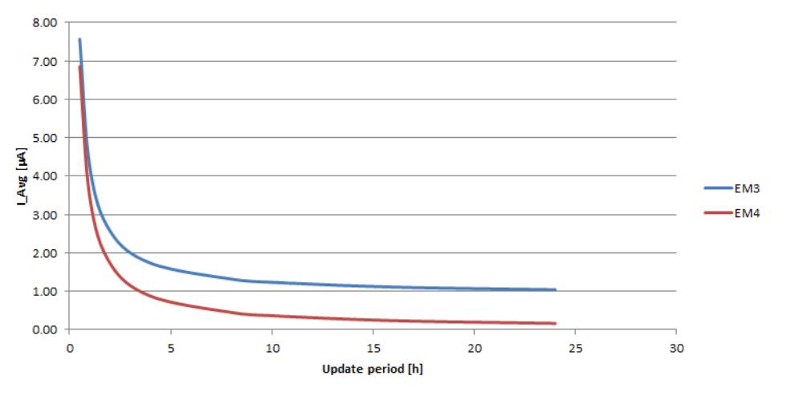
</p>

> Note: the graphic is a theoretical approximation in order to visualize the correlation among energy modes, the current consumption and the frequency of the ELD frame's update   

## 5 Software Examples

This application note comes with two software examples. 

### 5.1 Eink driver example

This example is the demo application the Eink EPD display will be driven directly with the EFR32xG22 MCU - and with the related development boards.

<p align="center">
  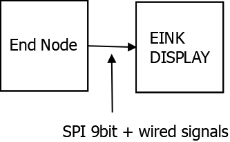
</p>

**Figure 5.1. Eink display and EFR driver**

In this example, the EFR32XG22 development board drives the Eink panel directly without any wireless connection. The new image frame will be compiled into the source code.

It requires the following boards and parts for this demo: 

 - Silabs BRD4001A WSTK main board

 - Silabs BRD4182A radio board

 - EINK E-tag TB7 display driver board

 - EINK EA2200-BJA display 

 - jumper cables

Mount the BRD4182A radio board to the BRD4001A WSTK mainboard and basing on the **Figure 2.4. Wirings among the WSTK and EINK driver** connect the EINK E-tag TB7 display driver board to the WSTK main board’s extended header. The EINK EA2200-BJA display should be also connected to the display driver. 

The EINK Image processing tool can be used to generate the byte streams for the DTM1 and DTM2 registers. In order to generate it, start the application, then “File” -> “Open File” to choose the desired picture. With “Process” -> rotate options, you can change the picture indentation to have a better look. Using no “Generate” button, the DTM1 and DTM2 related values can be found in the pc_tool/tmp/ bytestream_DTM2.txt and bytestream_DTM1.txt files. 

In order to copy-paste these previously generated byte streams to the EFR32's source code, open the Simplicity Studio V5 and import the *eink_brd4182a_simple_driver.sls* project from *SimplicityStudio\endnode\example_1* folder. Then navigate to the project related *root* folder, open the *app.c* file, then copy-paste the previously generated DTM1 and DTM2 values to the *app.c* file related *dtm1_buffer* and *dtm2_buffer* named arrays. (see: line 25) Do overwrite the previous values.

> ```
>  ...
>  
>  // !!! GENERATED FRAMES HERE !!! /// 
>  static uint8_t dtm1_buffer[BUFFER_SIZE] = ...  // generated stream here
>  static uint8_t dtm2_buffer[BUFFER_SIZE] = ...  // generated stream here
>
>  ...
>
> ```

Then compile it and load the newly generated *.hex file to the EFR32. When the example starts, the EPD display firstly shows the image, then the display became red, black, and finally, white image will be shown.

#### 5.1.1 SPI 9bit description

The EFR32MG22 uses its USART0 peripheral to perform the communication between the Eink display driver and itself, with the following attributes: 
 - baudrate: 115200 bps
 - format: 9 bits 

### 5.2 Eink driver example with wireless frame update

This example's end node side works as the previous example with extended wireless functionality. In the following steps, the new image will not be compiled into the EFR32xG22 firmware, instead, the new frame will be transferred via wireless proprietary protocol. 

<p align="center">
  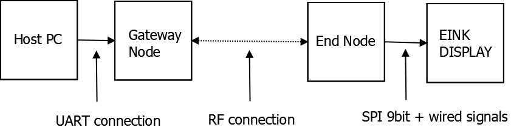
</p>

**Figure 5.1. Eink display and EFR driver via wireless update**

The following boards and parts are required for this demo: 
 - the end node side same as in the previous example (mainboard, radio board and wirings)
 - for gateway side: Silabs BRD4001A wstk mainboard and Silabs BRD4163A radio board
 
Hardware and firmware preparation to execute this example:
 - on the end node side the related hardware connection is same as in *Figure 2.4. Wirings among the WSTK and EINK driver*
 - on the gateway side the BRD4163A radio board should be mounted to the BRD4001A main board, then connect the main board to the Host PC
 - import both *eink_brd4182a_end_node* and *eink_brd4163a_gateway* projects into Simplicity Studio V5
 - then compile the *eink_brd4182a_end_node* and load the project related ``*.hex`` file to the EFR32xG22 board (end node) 
 - finally compile another, *eink_brd4163a_gateway* project, and load the generated ``*.hex`` file to BRD4163A board (gateway) 

> Note: The gateway related VCOM cts/rts settings should be also checked and in case of improper setting, modification would be required. The proper settings are highlighted in the Figure 5.2. The following knowledge base article describes the process of  modification and checking the actual values of the CTS/RTS pins: [KBA_BT_1208: Using virtual COM port (VCOM)](https://www.silabs.com/community/wireless/bluetooth/knowledge-base.entry.html/2018/08/28/using_virtual_compo-IYYh) 
> <p align="center">
>   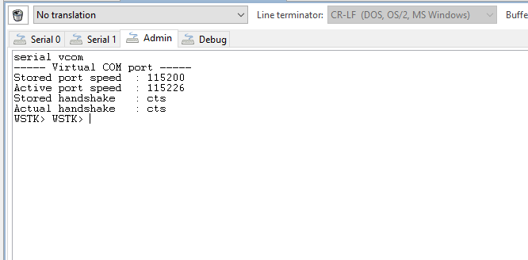
> </p>
> Figure 5.2. Gateway Node VCOM settings

The EINK Image processing tool can be used to send the new image to the end node. The preparation of the image is the same as in the previous example. After the preparation is finished, the EINK Image processing tool shall connect to the gateway, so click on the "Settings - Port" then chose the Gateway related port number. The previous port number choosing step does not initiate the sending process, so the sending should be initiated manually: Click to "Process" -> "Send to device" menu.

The blinking of the LEDs both on end node and gateway signaling that ongoing wireless traffic happens. At the end, the end node updates the new image frame to the Eink display. 

#### 5.2.1 Host PC description

The tested host PC was Windows 10 based computer but any computer can be used, which is capable to RS232 communication - or with extended USB-UART converter - and capable to run the python script. In this example the host PC just was used to perform the image manipulation, create the output byte streams for DTM1 and DTM2 arrays, and send these streams to the Gateway Node via UART Connection. The execution of the EINK Image Process tool, the Python version 3.9 should be used. The script requires additional libraries are mentioned in the pc_tool/readme.md file. 

#### 5.2.2 UART connection description

The Host PC and Gateway Node use UART for their interaction, namely the WSTK related VCOM port and the Host PC’s usb socket. The VCOM port uses the programmer IC of the WSTK, so in this setup no additional USB-UART converter is required.

The UART communication has the following parameters:
 - baudrate: 115200
 - format: 8N1
 - cts/rts used (just from host PC to gateway node) 

The commands between the two participants are [Gecko CLI based commands](https://docs.silabs.com/gecko-platform/latest/service/api/group-cli). The EINK Image Processing Tool issues these commands specially created for this application, like send the DTM stream related content, update the Eink display or clean the Eink display with the gateway node. As an advantage of this approach: without the EINK Image processing tool, just using a third party terminal tool (like: TeraTerm) the data can be sent to the gateway and the wireless transmission also can be started. 

The following CLI commands are implemented: 
 - *eink_update*:  sends the gateway node related DTM buffer values to the end node DTM buffers, then update the EINK display with the new, received image frame. After the command had been executed, the gateway sends a *gotosleep* command to the end node. 
 
 - *dtmx_update_buffer*: updates the gateway node local DTM buffers with argument specified values. It will not start the sending process among the end node and the gateway, it just fills the gateway buffers. 
   > dtmx_update_buffer command has 3 arguments:
   > - 1st: offset: the 3rd argument values will be inserted to the DTM buffer with this offset. For the calculation, to get exact DTM index, you should multiply the issued offset with 32. For example:  *dtmx_update_buffer 0 1 {FF FF FF}* will update the DTM1 buffer 0th, 1st and 2nd element with 0xFF. (because 0*32 = 0). But  *dtmx_update_buffer 1 1 {FF FF FF}* will update the DTM1 buffer 32th, 33th and 34th with 0xFF. (because 1*32 = 32)
   > - 2nd: DTM1 or DTM2 buffer. “1“ means DTM1 and “2“ means DTM2 buffers
   > - 3rd: data field, for sending desired data to the DTM buffers. It allows maximum 32 bytes. The format is: *{FF FF FF}* 
 - *eink_clean*:  gateway sends a command to the end node, causes the end node issues a function call to fill the EINK displays memory according to the content became just white. After the command had been executed, the gateway sends a *gotosleep* command to the end node.
 
 - *gotosleep*: gateway sends a command to the end node causes the end node goes to EM4 state for 10 second. After the 10th second, the end node wakes up and waiting for a new command. At default, if there is no new command, the gateway issues a new *gotosleep* command.  

<p align="center">
  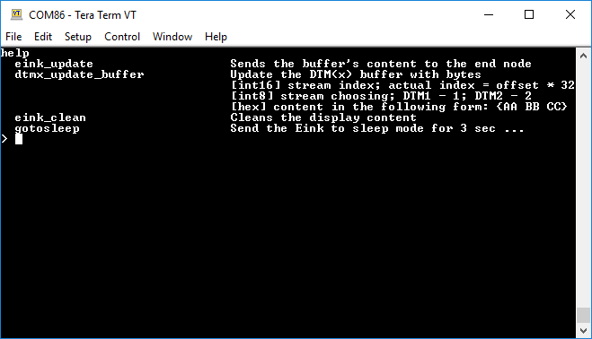
</p>

**Figure 5.3. CLI commands**  

On the other side, this CLI command approach also has some negative side effect: the CLI has some timing overhead, so the wired transmission is much-much slower than wireless. It can be eliminated in the future by using just the bare metal UART peripheral for the wired communication. 

#### 5.2.3 RF connection description

The gateway node and the end node uses proprietary protocol to exchange data among each other. The main details of the RF communication:
 - 2.45GHz
 - 2GFSK modulation
 - 250 kbps speed
 - variable payload length 
 - for more details, check the attached project related Radio Configurator's settings 
 
The gateway node slices the DTM buffers' content to 127 byte chunks, and these chunks will be sent to end node one by one. The RF frames are variable length frames, so the payload first byte contains the total length of the payload. With this approach, if the last chunk is not 127 byte long, then the sender and the receiver node can handle this scenario. The end node performs crc check on the received DTM data. If the received data fail on the crc checking, then end-node sends a NACK message to the gateway, and the gateway retransmitting the previously failed message.  
    

## 6 References

https://www.eink.com/electronic-ink.html


